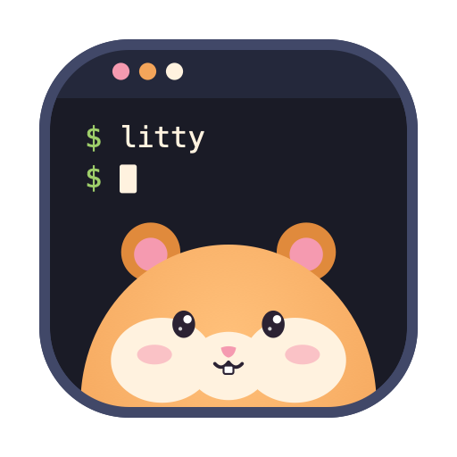

   
  <picture>
    <source media="(prefers-color-scheme: dark)" srcset="assets/logo/wordmark-dark.svg">
    
  </picture>

## Install

| Platform | Command |
|---|---|
| macOS (Homebrew) | `brew install --cask stawan15/tap/litty` |
| Linux (Homebrew) | `brew install stawan15/tap/litty` |
| Any (Rust) | `cargo install litty-term` or `cargo binstall litty-term` |
| Nix | `nix run github:stawan15/litty` |
| Arch (AUR) | `yay -S litty-bin` |
| Debian / Ubuntu | `sudo apt install ./litty_<version>_amd64.deb` (from Releases) |
| Fedora / RHEL | `sudo dnf install ./litty-<version>-1.x86_64.rpm` (from Releases) |
| macOS / Linux script | `curl -fsSL https://raw.githubusercontent.com/stawan15/litty/master/install.sh \| sh` |
| macOS by hand | open the `.dmg` from Releases and drag litty to Applications |

The macOS app is not notarized. Homebrew and the script clear the download quarantine for you; after a
manual download, right-click the app and choose Open, or run `xattr -dr com.apple.quarantine /Applications/litty.app`.

Build it yourself with `cargo build --release` (Linux) or `packaging/build-app.sh` (macOS app + dmg).

A small, fast terminal for macOS and Linux. Zero config: no settings file.

    cargo run --release            # login shell
    cargo run --release -- -e cmd  # run a command instead

## Configuration (optional)

litty needs no configuration. To change a default, create `~/.config/litty/config`
(`$XDG_CONFIG_HOME/litty/config`), one `key = value` per line, `#` for comments:

    theme = dark          # dark | light | auto (auto follows the system appearance at startup)
    font-size = 14        # points; overrides the zoom remembered from the last session
    cursor = block        # block | bar | underline
    cursor-blink = false
    tray = true           # macOS menu-bar hamster; false removes it

Changes apply the next time litty starts.

## Terminal features

Truecolor, 256 colours, bold/italic/underline, wide characters and combining marks (Thai), colour
emoji (single code points: ZWJ sequences, skin tones and flags show their parts), mouse reporting
(SGR), bracketed paste, focus events (1004), synchronized output (2026), OSC 7/8/52/133, colour
queries (OSC 4/10/11/12) and DECRQM mode queries, DSR, alternate screen, scrollback with reflow.
Not supported yet: images (sixel / Kitty graphics) and the Kitty keyboard protocol (queries are
answered as "no enhancements").

## Updates

litty checks for a newer release when it starts, at most once an hour (a single request to GitHub; turn it off with
`LITTY_NO_UPDATE_CHECK=1`). When one exists a small `↑ litty x.y.z` notice appears in the corner of the
window. Press Cmd+Shift+U (Ctrl+Shift+U on Linux) to open it: Enter downloads the release in the
background and installs it when you quit, Esc skips that version. Downloads are verified with an
ed25519 signature before anything is replaced. If a package manager installed litty (Homebrew, apt,
Nix, cargo), the notice shows the command to run instead and Enter copies it.

On macOS a small hamster sits in the menu bar. It runs in its wheel while a command is running in
any tab (zsh, or any shell that emits OSC 133), and stuffs its cheeks while an update downloads; a
blue dot means an update is ready. Its menu can check for updates, install one, open a window or
quit. When nothing is happening it stays still and costs no CPU.

## What makes it different

- **Command blocks.** With zsh (auto-enabled) or any shell that emits OSC 133, failed commands
  get a faint red tint on their output, and slow or failing commands show `exit N  1.2s` at the
  end of the command line. Cmd+Up / Cmd+Down jump between prompts.
- **Tabs and splits.** Cmd+T opens a tab in the current directory. On macOS tabs are native window
  tabs (real NSWindows in one tab group: drag to detach, Mission Control, the system tab bar); on
  Linux litty draws its own tab bar. Cmd+D splits right, Cmd+Shift+D splits down; drag a divider to resize; inactive
  panes are dimmed. Cmd+Shift+Enter zooms one pane.
- **Reflow.** Resizing re-wraps lines (prompts stay intact), keeping the cursor on its text.
- **Ligatures** (`=>`, `!=`, `->`, `<=`, `|>`, ...) with Maple Mono, plus bold-as-bright colours,
  block / underline / bar cursors (blinking when an application asks), double-click to select a
  word, triple-click a line, and the window remembers its size and zoom.
- **Scroll rail.** The right edge shows where you are in the history; failed commands and find
  matches appear as ticks. Click or drag it to jump.
- **Find** (Cmd+F): highlights every match, Enter / Shift+Enter to step, Esc to close.
- **Links:** hold Cmd (Ctrl on Linux) and click a URL.
- **Attention:** the Dock icon bounces when a command that ran 8 s or longer finishes in the
  background.
- **Maple Mono NF** (rounded, with Nerd Font icons and powerline glyphs) is used automatically when installed in `~/Library/Fonts`, `~/.local/share/fonts` or `~/.fonts` (files `MapleMono-NF-{Regular,Bold,Italic,BoldItalic}.ttf`, SIL OFL); otherwise Menlo / DejaVu Sans Mono.
- Correct Thai (tone marks and vowels stack on the base letter), procedural box drawing,
  bold/italic/underline, truecolor, 20k lines of compact scrollback.

## Keys

| Key | Action |
| --- | --- |
| Cmd+C / Cmd+V | Copy selection / paste (Ctrl+Shift on Linux) |
| Cmd+T / Cmd+W | New tab / close pane or tab (Ctrl+Shift+T / W on Linux) |
| Cmd+Shift+[ / ] , Ctrl+Tab | Previous / next tab |
| Cmd+1 … 8, Cmd+9 | Go to tab N / last tab (Alt+N on Linux) |
| Cmd+D / Cmd+Shift+D | Split right / down (Ctrl+Shift+O / E on Linux) |
| Cmd+[ / ] | Previous / next pane |
| Cmd+Option+arrows | Focus the pane in that direction |
| Cmd+Ctrl+arrows / Cmd+Ctrl+= | Move the split / equalize splits |
| Cmd+Shift+Enter | Zoom the focused pane |
| Cmd+K | Clear screen and scrollback |
| Cmd+N | New window |
| Cmd+F | Find |
| Cmd+Up / Down | Previous / next prompt |
| Cmd+Left / Right / Backspace | Start of line / end of line / delete line |
| Cmd+= / Cmd+- / Cmd+0 | Zoom in / out / reset |
| Shift+PageUp / PageDown / Home / End | Scroll history |
| Option+Left / Right | Word left / right |

Mouse-aware programs (vim, tmux, htop) receive the mouse; hold Shift to select text instead.

Debugging: `LITTY_LOG=/tmp/lt.log litty` records every byte read from the shell, every key sent and every resize with timestamps, so a display glitch can be replayed exactly.
